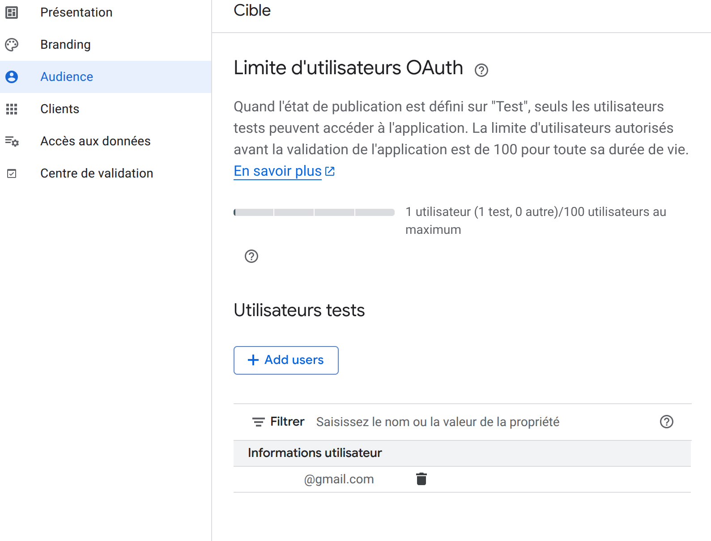
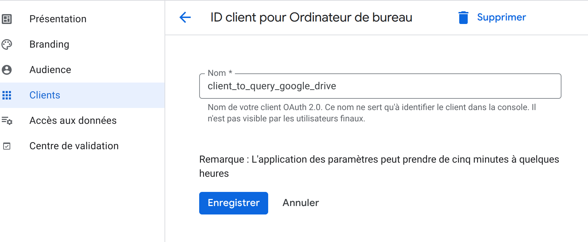
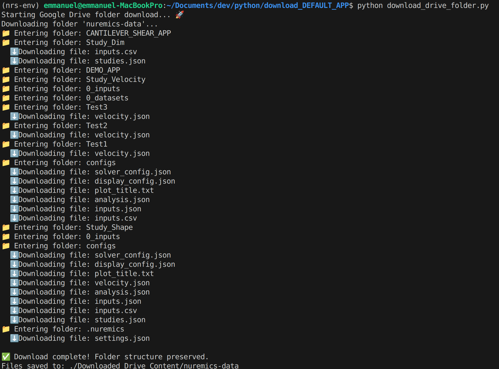

You need the Google API client libraries. Install them using pip:

```bash
pip install google-api-python-client google-auth-oauthlib google-auth-httplib2
```

Use a Gmail account and go to Google Cloud console:
https://console.cloud.google.com/
Then select APIs and services:


You must also have your Google API Client Credentials file (usually named credentials.json) downloaded from the Google Cloud Console and placed in the same directory as this Python script.


## How to get your credentials.json


Here is the step-by-step process to generate and download the `credentials.json` file for a desktop or local application:

---

## Steps to Obtain `credentials.json`

### 1. Create a Project

1.  Go to the **Google Cloud Console**.
2.  In the project selector dropdown at the top, create a **New Project** or select an existing one.

### 2. Enable the Google Drive API

1.  Navigate to **"APIs & Services"** $\rightarrow$ **"Library"**.
2.  Search for **"Google Drive API"**.
3.  Click on the Google Drive API and then click **Enable**.

### 3. Configure the OAuth Consent Screen

This step defines what users see when they authorize your app.

1.  Navigate to **"APIs & Services"** $\rightarrow$ **"OAuth consent screen"**.
2.  Select the **User Type** (e.g., "External" for public use or "Internal" if you only use it within your organization).
3.  Fill in the required information, such as the **App name** and a **User support email**.
4.  On the **Scopes** page, click **Add or Remove Scopes**. You must add the scope for the Drive API, such as `.../auth/drive.readonly` (for downloading) or `.../auth/drive` (for full access).


5.  Follow the prompts to complete the configuration (Test users, Summary).

Add the authorized User Test mail:


### 4. Create and Download Credentials

1.  Navigate to **"APIs & Services"** $\rightarrow$ **"Credentials"**.
2.  Click **+ CREATE CREDENTIALS** at the top and select **"OAuth client ID"**.
3.  For the **Application type**, select **"Desktop app"** (This is the correct type for local Python scripts).
4.  Give your client a descriptive name and click **Create**.
5.  A box will appear showing your Client ID and Client Secret. **Crucially, click the DOWNLOAD JSON button.** 

The downloaded file will be named something like `client_secret_ABCDE12345.json`. **Rename it to `credentials.json`** and place it in the same directory as your Python script. The script uses this file to authenticate and generate the `token.json` file.



## Is configuring the OAuth Consent Screen mandatory ?

Yes, **configuring the OAuth Consent Screen is mandatory**, even if you only need the `credentials.json` file for a Python script accessing your own Google Drive files.

The reason is that the **OAuth Consent Screen** serves a critical purpose in the Google API ecosystem, regardless of the application's size or scope:

1.  **Authorization Framework:** It's the first required step in setting up any OAuth 2.0 client ID (which is what the `credentials.json` file defines). It establishes the **identity and requested permissions (scopes)** of your application within the Google Cloud Project.
2.  **Defining Scopes:** It's where you define the **scopes** (e.g., read-only access to Drive) that your Python script will request. Without these scopes defined, the API access will fail.
3.  **Security and Trust:** It sets the **User Type** (External or Internal).
    * For **Internal** use (within a Google Workspace organization), it tells Google that your app is trusted for employees.
    * For **External** use (like a personal script), it is still required to define the app's name and email, even if you are the only user.

---

### Special Consideration for Local Scripts (Desktop App)

Since your Python script uses the **"Desktop app"** application type, the OAuth flow works locally:

1.  The Python script reads the **`credentials.json`** file.
2.  The script then launches a browser window, presenting you with the **Consent Screen**.
3.  You must manually click "Allow" to grant the script permission to access your Drive.

This entire process relies on the Consent Screen being properly configured beforehand. If the screen isn't set up, you won't be able to complete this initial authorization step, and the script won't be able to generate the reusable **`token.json`** file needed for subsequent access.

User Type: external or Internal?

To download files using your Python script, you should typically select **External** as the User Type during the OAuth Consent Screen configuration, even if you are the only person using the script.

Here's a breakdown of why:

## User Type Selection

| User Type | When to Choose | Requirements |
| :--- | :--- | :--- |
| **External** | **Recommended** for personal projects, scripts, or apps used by any Google account that is **not** part of your Google Workspace (G Suite) organization. | Only requires basic app info setup for personal use. |
| **Internal** | Only choose this if your Google account is part of a **Google Workspace domain** (e.g., your company's paid G Suite account) **and** you only intend to use the script with accounts within that specific organization. | No verification is needed, but access is restricted to the domain. |

## Why External is Usually Correct for Scripts

Most users creating a personal script are doing so under a standard, free, or personal Google account (e.g., `@gmail.com`).

* If your account is a standard Gmail account, **you must choose External.** You will not be able to choose Internal.
* Selecting **External** allows the script to function immediately for your own personal use.

The only time you would select **Internal** is if you are operating within a managed Google Workspace environment and strictly intend for the script to be used only by other members of that managed environment.

To download files using your Python script, you should typically select **External** as the User Type during the OAuth Consent Screen configuration, even if you are the only person using the script.

Here's a breakdown of why:

## User Type Selection

| User Type | When to Choose | Requirements |
| :--- | :--- | :--- |
| **External** | **Recommended** for personal projects, scripts, or apps used by any Google account that is **not** part of your Google Workspace (G Suite) organization. | Only requires basic app info setup for personal use. |
| **Internal** | Only choose this if your Google account is part of a **Google Workspace domain** (e.g., your company's paid G Suite account) **and** you only intend to use the script with accounts within that specific organization. | No verification is needed, but access is restricted to the domain. |


# How to run?
Once you get the credentials.json   
You can start a python context the way you want and then run:
```bash
python download_drive_folder.py
```

You will get like this:



